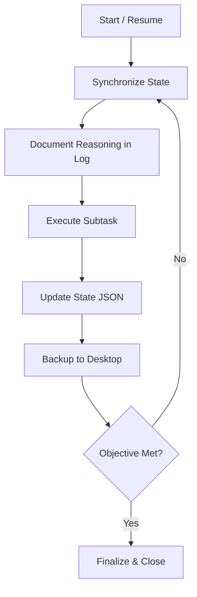

# 🤖 Autonomous Prompt Manager (APPM) v2

The **Autonomous Persistent Prompt Manager (APPM)** is a stateful orchestration layer built on the **Reason-Act-Reflect-Verify (RARV)** protocol. It ensures that ARIA maintains a clear memory of the global objective, subtask progress, and decision history across sessions using a triple-tier memory system.

## 🎯 When to Use

- **Long-running Tasks**: Projects that span multiple turns or sessions.
- **Complex Decompositions**: Tasks requiring granular subtask management.
- **High-Stakes Operations**: When mandatory security hooks and audit trails are required.
- **Context Persistence**: When loss of "Mistakes & Learnings" would stall progress.

## 🕹️ Core Components

1. **State Tracker (`appm_state.json`)**: Tracks the objective, subtasks, and completion status.
2. **Logic Log (`LOGIC_LOG.md`)**: A real-step-by-step stream of the RARV reasoning cycle.
3. **Continuity Layer (`CONTINUITY.md`)**: Volatile working memory for immediate blockers and learnings.
4. **Security Guardrails (`security-guardrails.sh`)**: Pre-execution tripwires for dangerous commands.
5. **Backup Utility (`backup-logic.sh`)**: Automatic sync to `~/Desktop/APPM_BACKUPS`.

## 🚀 Getting Started

### 1. Initialization
Create the following files in your project's `_scripts/` or `.agents/` directory using the templates provided in this skill:
- `_scripts/appm_state.json`
- `_scripts/LOGIC_LOG.md`

### 2. Implementation
Add the `backup-logic.sh` to your scripts and ensure it is executable.

### 3. Usage
Trigger the `/autonomous-manager` workflow to begin or resume a task.

---

## 📜 Best Practices

- **Atomic Updates**: Update the state file before and after every major tool execution.
- **Reasoning First**: Document the "Why" in the logic log BEFORE taking action.
- **Subtask Granularity**: Keep subtasks small and measurable.
- **External Backups**: Always run the backup script after updating the state.

## 🔄 The APPM Loop

